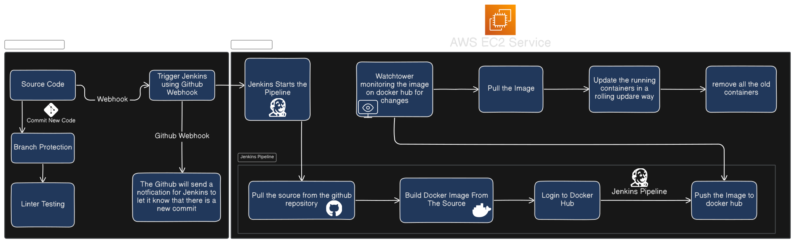
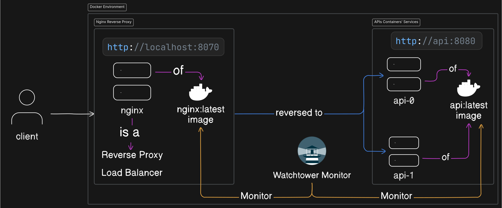

# Complete Automated Pipeline Deployment

## Table of Contents

1. [Introduction](#introduction)
2. [Pipeline Diagram](#pipeline-diagram)
3. [Reverse Proxy and Load Balancer Diagram](#reverse-proxy-and-load-balancer-diagram)
4. [Development Environment](#development-environment)
    - [Source Code](#source-code)
    - [Branch Protection](#branch-protection)
    - [Linter Testing](#linter-testing)
5. [Jenkins CI/CD Pipeline](#jenkins-ci-cd-pipeline)
    - [Trigger Jenkins using GitHub Webhook](#trigger-jenkins-using-github-webhook)
    - [Pull Source from GitHub](#pull-source-from-github)
    - [Build Docker Image](#build-docker-image)
    - [Push Docker Image to Docker Hub](#push-docker-image-to-docker-hub)
6. [AWS EC2 Deployment](#aws-ec2-deployment)
    - [Watchtower Monitoring](#watchtower-monitoring)
    - [Rolling Update](#rolling-update)
7. [Installation Guide](#installation-guide)
    - [Prerequisites](#prerequisites)
    - [Steps for Setup](#steps-for-setup)
8. [License and Author](#license-and-author)

## Introduction

This project demonstrates a complete automated deployment pipeline for a Todo application using Docker, Jenkins, and Docker Compose. It utilizes GitHub for version control, Jenkins for CI/CD, and AWS EC2 as the deployment environment.

## Pipeline Diagram

The following diagram illustrates the complete CI/CD pipeline setup that involves source code management, Jenkins automation, Docker image building, and Watchtower monitoring:



## Reverse Proxy and Load Balancer Diagram

The following diagram illustrates the setup of a reverse proxy and load balancer using Nginx to route traffic to multiple services of the Todo api:



## Development Environment

### Source Code

-   The source code is hosted in a GitHub repository, containing the application logic, infrastructure configuration, and other essential files.

### Branch Protection

-   Branch protection policies ensure that only tested and reviewed code gets merged into the main branch.

### Linter Testing

-   Linter testing ensures code quality by enforcing coding standards and identifying issues early in the development pipeline.

## Jenkins CI/CD Pipeline

### Trigger Jenkins using GitHub Webhook

-   A GitHub webhook notifies Jenkins of any new commits, automatically triggering the build and deployment pipeline.

### Pull Source from GitHub

-   Jenkins pulls the latest code from the GitHub repository to ensure that it is using the most current version.

### Build Docker Image

-   Jenkins builds a Docker image from the source code using the Dockerfile defined in the repository.

### Push Docker Image to Docker Hub

-   Jenkins logs into Docker Hub and pushes the built Docker image, making it available for deployment.

## AWS EC2 Deployment

### Watchtower Monitoring

-   Watchtower monitors the Docker Hub repository for any updates to the Docker image, ensuring the deployment is always using the latest version.

### Rolling Update

-   When a new Docker image is detected, Watchtower updates the running containers using a rolling update strategy, minimizing downtime.

## Installation Guide

### Prerequisites

You need to have the following software installed on your machine:

-   Git
-   Docker
-   Docker Compose

### Steps for Setup

1. **Clone the Repository:**

    ```bash
    git clone https://github.com/moheladwy/TodoDeployment.git Todo-Deployment
    ```

2. **Navigate to the Project Directory:**

    ```bash
    cd Todo-Deployment
    ```

3. **Make the Script Executable:**

    ```bash
    chmod +x ./start-all.sh
    ```

4. **Start the Application:**
   Run the startup script to:

    - Launch Watchtower to monitor container updates.
    - Start Portainer for Docker environment management.
    - Set up Jenkins for CI/CD automation.

    ```bash
    ./start-all.sh
    ```

5. **Access Portainer:**
   Open your browser and navigate to `https://localhost:9443` to access Portainer. Create a new user account and log in.

6. **Access Jenkins:**
   Navigate to `http://localhost:8090` to access Jenkins. Unlock Jenkins by following these steps:

    - Open the console of the Jenkins container in Portainer.
    - Retrieve the secret key:

    ```bash
    cat /var/jenkins_home/secrets/initialAdminPassword
    ```

    - Use the key to unlock Jenkins, install the suggested plugins, and create a new admin user.

7. **Set Up Jenkins Pipeline:**

    - Create a new pipeline and configure it to use the Jenkinsfile from the repository:
      `https://github.com/moheladwy/TodoFullstack.git`.
    - Add Docker Hub credentials to Jenkins.
    - Update the Jenkinsfile with your Docker Hub repository, save, and run the pipeline. This will build and push the Todo API image to Docker Hub.

8. **Update The `todo-compose.yml` File:**

    - Modify the image name in the `todo-compose.yml` file to point to your Docker Hub repository instead of `only1adwy/todo-api`.

9. **Start the Todo API:**

    ```bash
    docker-compose -f todo-compose.yml up -d
    ```

10. **Monitor with Watchtower:**
    Watchtower will automatically update the Todo API container with the latest image once it is pushed to Docker Hub.

11. **Access the Todo API:**
    Open your browser and navigate to `http://localhost:8070/swagger/index.html` to access the Todo API.

## License and Author

This project is open source, feel free to use, modify, and distribute the code as needed. If you have any questions or suggestions, please feel free to reach out.

**Author: Mohamed Al-Adawy**

-   GitHub: [https://github.com/moheladwy](https://github.com/moheladwy)
-   Website: [https://al-adawy.netlify.app](https://al-adawy.netlify.app)
-   LinkedIn: [https://www.linkedin.com/in/mohamedhusseineladwy](https://www.linkedin.com/in/mohamedhusseineladwy)
